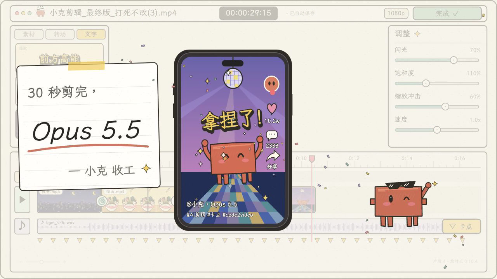

# 小克剪视频 · Remotion 复刻

用 React、SVG 和 Remotion 重建的 30 秒手绘剪辑动画。机器人依次拖入夜景、拉面、柴犬和蹦迪素材，剪掉发呆片段，添加转场和字幕，调整画面、卡点并导出成片。



对应动效片段：[claude_剪视频过程motion](https://motionface.cc/?recording=e3ee409a-50f7-4b4a-af27-288226e47a57)。片段编号：`e3ee409a-50f7-4b4a-af27-288226e47a57`。

## 运行

需要 Node.js 22.18 或更新版本，以及 npm。

```bash
npm ci
npm run build
```

直接用浏览器打开 `dist/index.html` 即可观看，不需要启动服务器。生成页面中的程序与字体已经内嵌，音轨从相邻的 `dist/assets/` 读取，因此分享预览时请保留整个 `dist` 文件夹。

播放条提供播放／暂停、拖动进度、重播、0.5／1／1.5／2／3 倍速和声音开关。初始静音；空格切换播放。系统开启「减少动态效果」时初始暂停，切到后台时暂停。倍速后的时间显示为实际播放用时。

需要编辑组件或查看逐帧时间轴时：

```bash
npm start
```

这会启动 Remotion Studio；终端会显示地址。它是开发工具，静态预览无需运行此命令。

## 渲染

```bash
npm run render
```

生成 `delivery/claude-video-editing.mp4`，1280×720、30 帧/秒、900 帧、H.264，包含原片音轨。首次运行时 Remotion 可能下载其使用的 Chrome Headless Shell。

也可以指定已安装的 Chrome，例如 macOS：

```bash
npm run render -- --browser-executable="/Applications/Google Chrome.app/Contents/MacOS/Google Chrome"
```

导出单帧：

```bash
npm run still
# 自选帧（第 885 帧是结尾）
npx remotion still src/index.ts ClaudeVideoEditing delivery/ending.png --frame=885
```

## 修改画面

| 文件 | 内容 |
| --- | --- |
| `src/Film.tsx` | 整体画面、手机预览、结尾纸条和声音 |
| `src/timeline.ts` | 帧数、分段、镜头和参数变化 |
| `src/components/Artwork.tsx` | 夜景、拉面、柴犬、舞池四种矢量画面 |
| `src/components/Drawing.tsx` | 手绘边框、机器人、伸长手臂、星星 |
| `src/components/Editor.tsx` | 素材栏、转场图标、参数面板和剪辑轨道 |
| `src/preview.tsx`、`src/preview.css` | 静态预览与播放控件 |

画面由代码逐帧生成，没有嵌入参考视频或用截图充当背景。改变当前帧即可还原该时刻的全部视觉状态；随机细节使用固定种子，倒放、跳转和导出可复现。播放控件不会渲染进成片。

字体为霞鹜文楷的字符子集，随仓库提供；增加字幕时，如果使用了子集以外的汉字，可按 `public/ASSETS.md` 中的来源替换为完整字体。

## 验证

```bash
npm run check
npm run build
npm run render
npm run verify
```

最后一条命令需要 `ffmpeg` 和 `ffprobe`，会核对尺寸、帧率、帧数、时长与音轨，并完整解码成片。阶段分析见 [参考拆解](docs/REFERENCE-ANALYSIS.md)，本次验收记录见 [验证记录](docs/VALIDATION.md)。

复刻保留构图、剧情、主色、剪辑操作和镜头节奏；手绘曲线、字体细节、缩略图和个别转场经过矢量重建，属于近似还原，并非逐像素复制。

## 资源与许可

代码采用 MIT 许可；字体遵循随附的 [SIL OFL](public/OFL.txt)。音轨来自用户提供的参考片段，原作品及音轨权利归各自权利人，不属于本仓库的 MIT 代码许可。来源说明见 [素材说明](public/ASSETS.md)。Remotion 的使用条件以其[官方许可](https://www.remotion.dev/license)为准。

源码、锁文件、字体、音轨和构建脚本均在仓库内。参考视频、分析中间帧、缓存与本地导出视频不提交；仓库不包含临时下载地址或绑定凭证。

本机项目组织及播放控件规范的唯一正本为父级 `scenes/README.md`；本仓库不复制这份本地代理规则。
